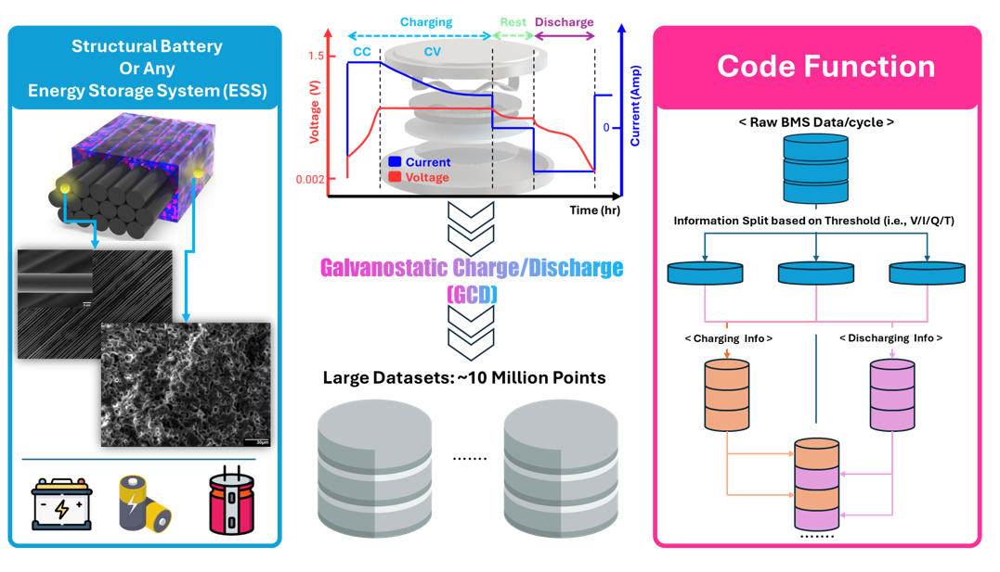

# Battery Data Structuring

This repository contains MATLAB code for transforming raw battery cycling data from Battery Management Systems (BMS) into a structured format, similar to the widely used NASA battery dataset.  
The script demonstrates how to preprocess, categorize, and organize voltage, current, and capacity measurements into clear structures (charging, discharging, resting).  
This code was used in the paper titled: *"Computational Micromechanics and Machine Learning-Informed Design of Composite Carbon Fiber-Based Structural Battery for Multifunctional Performance Prediction."*

It is a simple code that employs MATLAB’s built-in functions to prepare battery cycling data for analysis and machine learning applications.

  

---

## Features  
- Reads and combines data from multiple Excel sheets.  
- Separates the data into charging, discharging, and rest periods.  
- Structures each cycle’s voltage, current, capacity, and test time data.  
- Normalizes time for each cycle to start from zero for consistency.  
- Saves the structured dataset into a `.mat` file for easy access and further processing.

---

## Implementation Details  

### Prerequisites  
- MATLAB installed on your system.  
- Excel file containing the raw battery cycling data.  
I used an example named `SPE40_0.1C.xlsx` in the demonstration.

---

## Usage  

### Steps to Run the Code  
- Open the MATLAB script (`Data_Structuring.m`).  
- Update the Excel file name if necessary inside the script.  
- Run the script to process the data and generate the structured output.  
- I divided the code into sections and included comments to clarify the purpose of each part for easier navigation.

### Key Steps Performed by the Code  

1. **Data Loading:**  
- Reads and combines all sheets from the Excel file into a single matrix.

2. **Cycle Classification:**  
- Identifies and separates charging, discharging, and rest phases based on the current measurement.

3. **Data Structuring:**  
- Organizes voltage, current, capacity, and time into structured fields for each cycle.

4. **Time Normalization:**  
- Adjusts the `test_time` to start from zero for each charging and discharging step.

5. **Saving Structured Data:**  
- Saves the final structured dataset into a `.mat` file (example output: `SPE40_0p1C.mat`).

---

## Output  

### Structured Data Format  
#### Saved .MAT File  
- Includes separate structures for charging and discharging cycles (`SPE40_0p1C.mat`).

#### Organized Data Fields  
- Each cycle includes:  
  - Test time array  
  - Voltage measurements  
  - Current measurements  
  - Capacity readings

---

## Citation  

If you use this code in your research or publications, please cite the associated work:  
> M. A. Raja, W. Kim, W. Kim, S. H. Lim, and S. S. Kim,  
> *"Computational Micromechanics and Machine Learning-Informed Design of Composite Carbon Fiber-Based Structural Battery for Multifunctional Performance Prediction,"*  
> ACS Applied Materials & Interfaces, vol. 17, no. 13, pp. 20125–20137, Feb. 2025.  
> doi: [10.1021/acsami.4c19073](https://doi.org/10.1021/acsami.4c19073)

---

## License  

This project is licensed under the MIT License. See the [LICENSE](LICENSE) file for more details.

---
